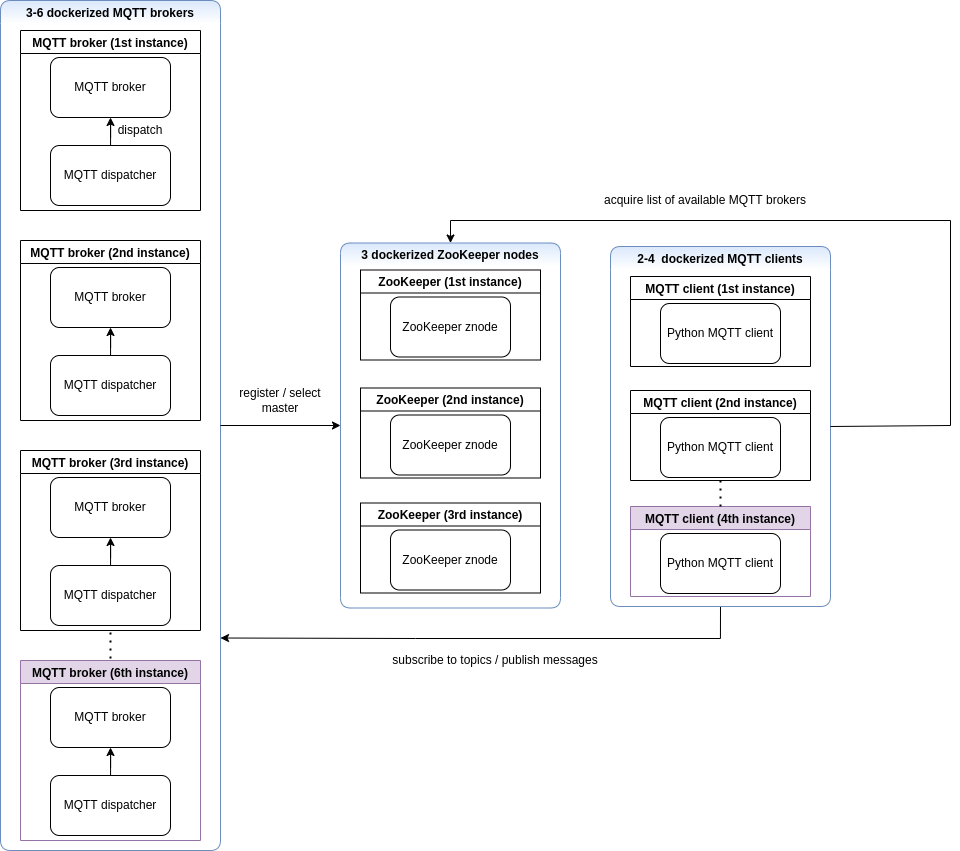
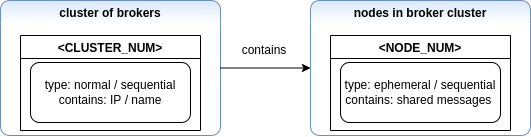

# KIV-DS-3HW
1) Architektura systému

Předmětem kapitol níže je popis systému jakožto celku.

1.a) Diagram

Architekturu systému popisuje následující diagram.

1.b) Vysvětlivky k entitám diagramu

#### MQTT broker ####
- v rámci jednoho clusteru existují v množství 3-6
- využití open-source MQTT brokera Mosquitto + program v Pythonu
- zařizuje předávání zpráv mezi jednotlivými brokery
- stará se o registraci v rámci Apache ZooKeepr

#### ZooKeeper node ####
- v rámci jednoho clusteru existují ve fixním množství 3
- instance open-source Apache ZooKeeper (řízení distribuovaných uzlů)

#### MQTT client ####
- v rámci jednoho clusteru existují v množství 2-4
- schopen získat seznam funkčních MQTT brokerů v clusteru
- algoritmem vybere vhodný broker; pokud ztráta spojení, je vybrán nový broker

2) Skladba jmenného prostoru

Následující kapitoly charakterizují skladbu jmenného prostoru ZooKeeperu.

2.a) Diagram

Diagram jmenného prostoru je vidět níže.

2.b) Vysvětlivky k entitám diagramu

#### <CLUSTER_NUM> ####
- uzel typu normal / sequential
- jeho podmnožinou budou uzly typu <NODE_NUM>
- NUM bude nahrazeno pořadím, ve kterém byl cluster vytvořen (proto sequential)

#### <NODE_NUM> ####
- uzel typu normal / sequential
- uzly tohoto názvu jsou podmnožinou <CLUSTER_NUM>
- NUM bude nahrazeno pořadím, ve kterém byl uzel vytvořen (proto sequential)
